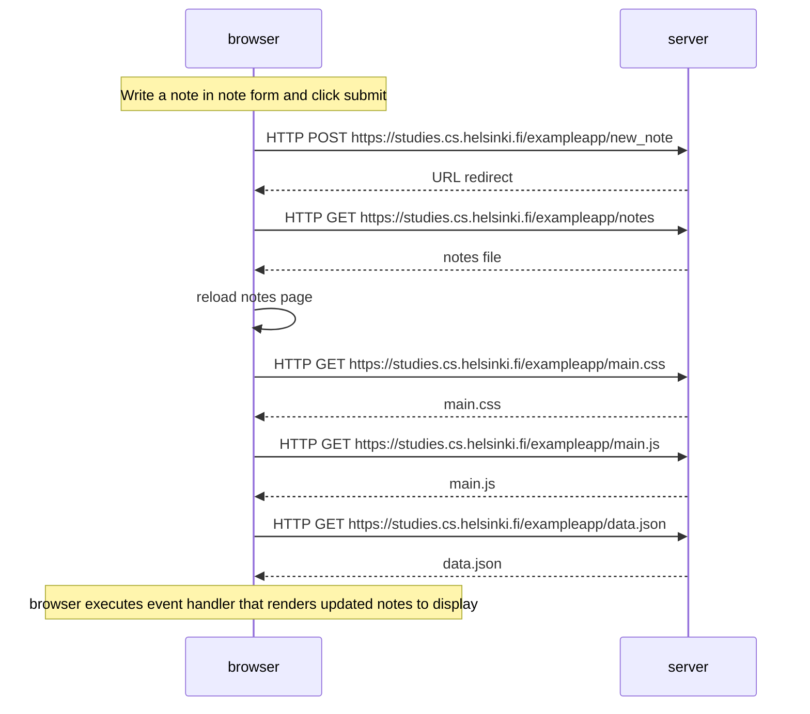

```mermaid
sequenceDiagram
  Participant browser
  Participant server
  note over browser: Write a note in note form and click submit
  browser ->> server: HTTP POST https://studies.cs.helsinki.fi/exampleapp/new_note
  server -->> browser: URL redirect
  browser ->> server: HTTP GET https://studies.cs.helsinki.fi/exampleapp/notes
  server -->> browser: notes file
  browser ->>browser: reload notes page 
  browser ->> server: HTTP GET https://studies.cs.helsinki.fi/exampleapp/main.css
  server -->> browser: main.css
  browser ->> server: HTTP GET https://studies.cs.helsinki.fi/exampleapp/main.js
  server -->> browser: main.js
  browser ->> server: HTTP GET https://studies.cs.helsinki.fi/exampleapp/data.json
  server -->> browser: data.json
  note over browser: browser executes event handler that renders updated notes to display
  

```
